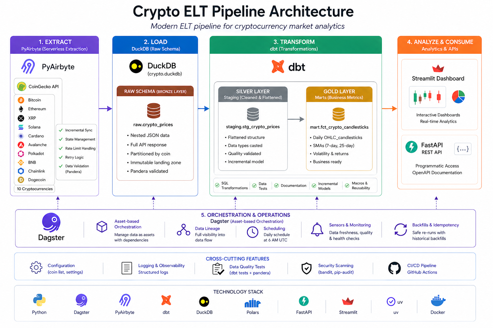
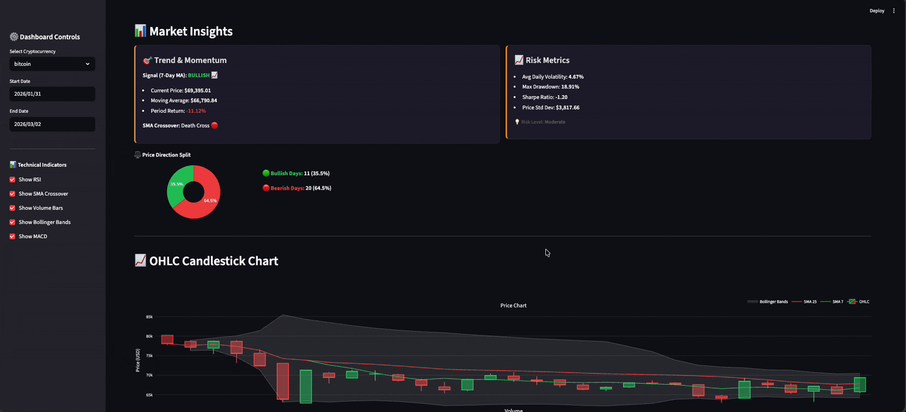

# Crypto ELT Pipeline

> **Modern ELT pipeline** analyzing cryptocurrency market trends through OHLC candlestick charts and volatility metrics. Features incremental extraction, Medallion architecture, and full data lineage. Built with Dagster, PyAirbyte, dbt, DuckDB, Polars, and Streamlit.

[](https://www.python.org/downloads/)
[](https://github.com/mohamed-boughattas/crypto-elt-pipeline/actions/workflows/ci.yml)
[](https://docs.pytest.org/)
[](https://pandera.readthedocs.io/)
[](https://pola.rs/)
[](https://pyairbyte.readthedocs.io/)
[](https://docs.astral.sh/uv/)
[](https://docs.astral.sh/ruff/)
[](https://www.docker.com/)
[](https://app.codecov.io/gh/mohamed-boughattas/crypto-elt-pipeline)
[](https://dagster.io/)
[](https://www.getdbt.com/)
[](https://duckdb.org/)
[](https://fastapi.tiangolo.com/)
[](https://streamlit.io/)
[](https://sqlfluff.com/)
[](https://github.com/microsoft/pyright)
[](https://bandit.readthedocs.io/)
[](https://pypi.org/project/pip-audit/)

---

## 🎯 What It Does

Automated pipeline that:

- 📥 **Extracts** cryptocurrency market data from CoinGecko API using PyAirbyte (incremental loading)
- 🔄 **Transforms** raw data into analytics-ready OHLC candlesticks (dbt + Medallion Architecture)
- 📊 **Visualizes** trends via interactive Streamlit dashboard
- 🚀 **Orchestrates** everything through Dagster with full data lineage
- ⏰ **Schedules** daily automated refreshes at 6 AM UTC

**Supported Cryptocurrencies:** Bitcoin, Ethereum, XRP, Solana, Cardano, Avalanche, Polkadot, BNB, Chainlink, Dogecoin (10 coins)

**Key Innovations:**

- **Incremental extraction** significantly reduces API calls on daily runs
- **Incremental Silver layer** for efficient data processing
- **Automated monitoring** with data freshness and quality sensors

---

## 🏗️ Architecture Overview



**Data Flow:**

1. **Bronze**: Raw nested CoinGecko data (immutable landing zone) - Pandera validated
2. **Silver**: Flattened & cleaned (`stg_crypto_prices`) - incremental, dbt tested
3. **Gold**: Business metrics (`fct_crypto_candlesticks`) - table with SMAs

### Data Materialization Flow

```text
┌─────────────────────────────────────────────────────────────┐
│                    DuckDB (crypto.duckdb)                    │
│  ┌─────────────┐  ┌─────────────┐  ┌──────────────────────┐ │
│  │ raw schema  │→ │staging schema│→ │ mart schema          │ │
│  │(Bronze)     │  │(Silver)      │  │ (Gold)               │ │
│  └──────┬──────┘  └──────┬──────┘  └──────────┬───────────┘ │
└─────────┼────────────────┼───────────────────┼──────────────┘
          │                │                   │
    Dagster IO        dbt runs            dbt creates
    Manager writes    transformations     final tables
                                              │
                                              ▼
                                    ┌─────────────────┐
                                    │   Streamlit     │
                                    │   Dashboard     │
                                    └─────────────────┘
```

> **📚 Deep dive:** [System Design Documentation](docs/system-design.md)

---

## 🎬 Dashboard Demo



The interactive dashboard features real-time crypto analytics with:

- 💰 **Price metrics**: Live price, 24h high/low, volume, volatility percentage
- 📈 **Interactive charts**: OHLC candlesticks with zoom & pan
- 📊 **Volume analysis**: Trading volume trends over time
- 📉 **Volatility tracking**: Daily volatility percentage
- 🎯 **Key statistics**: Historical highs/lows, averages
- 📅 **Date filtering**: Analyze specific time periods
- 📱 **Multi-coin support**: Switch between 10 cryptocurrencies

---

## ⚡ Quick Start

### Prerequisites

- Python 3.12
- [uv](https://docs.astral.sh/uv/) installed
- Docker (required for PyAirbyte connectors)
- (Optional) CoinGecko Pro API key for higher rate limits

### Run the Pipeline

```bash
# Clone the repository
git clone https://github.com/mohamed-boughattas/crypto-elt-pipeline.git
cd crypto-elt-pipeline

# One command to rule them all
just start
```

**That's it!** 🎉

- **Dagster UI**: <http://localhost:3000>
- **Streamlit Dashboard**: <http://localhost:8501>
- **FastAPI Server**: <http://localhost:8000>
- **API Documentation**: <http://localhost:8000/docs>

### ❄️ Cold Start (First Run)

For new developers or after a fresh clone:

```bash
# 1. Ensure Docker is running
docker info

# 2. Install dependencies
just setup

# 3. Run initial data load (~3-5 min for 10 coins)
just pipeline

# 4. Launch dashboard
just dashboard
```

### Verify Pipeline Success

```bash
just status
# Expected output:
# ✅ Database exists: data/crypto.duckdb
# 📦 Database size: 15M
# 📈 Record counts (Bronze Layer):
#   - bitcoin: 7,200 records
#   - ethereum: 7,200 records
#   ...
```

> **Need detailed setup?** See [Setup Guide](docs/setup-guide.md)

---

## ⏱️ Expected Runtime

| Operation                            | Time (Free API) | Time (Pro API) | Notes                                                      |
| ------------------------------------ | --------------- | -------------- | ---------------------------------------------------------- |
| **Initial load** (10 coins, 30 days) | ~3-5 min        | ~1-2 min       | First run fetches full history (parallelized)              |
| **Daily refresh** (incremental)      | ~30-60 sec      | ~10-20 sec     | Only fetches new data (parallelized) |
| **Single coin**                      | ~1-2 min        | ~15-30 sec     | Useful for testing or quick updates                        |
| **dbt transformations**              | ~30-60 sec      | ~30-60 sec     | Same for both tiers (local processing)                     |
| **Dashboard load**                   | ~5-10 sec       | ~5-10 sec      | Queries DuckDB directly                                    |

**Performance Improvements:**

- **Incremental loading**: Only fetches new data since last run
- **Hourly resampling**: Normalizes API granularity differences automatically

**Factors affecting runtime:**

- CoinGecko rate limits: Free tier ~10-50 calls/min, Pro tier ~500+ calls/min
- Docker container startup time (PyAirbyte connector)
- Network latency to CoinGecko API
- System resources (CPU/RAM)

---

## 🛠️ Tech Stack

| Layer               | Technology         | Purpose                                  |
| ------------------- | ------------------ | ---------------------------------------- |
| **Orchestration**   | Dagster            | Asset-based workflow orchestration       |
| **Extraction**      | PyAirbyte          | Serverless data ingestion                |
| **Transformation**  | dbt                | SQL-based modeling (Medallion)           |
| **Storage**         | DuckDB + Polars    | Embedded OLAP database                   |
| **API**             | FastAPI            | RESTful data access endpoint             |
| **Visualization**   | Streamlit          | Interactive dashboards                   |
| **Package Manager** | uv                 | Ultra-fast dependency resolution         |
| **Security**        | Bandit + pip-audit | Code & dependency vulnerability scanning |

---

## 📁 Project Structure

```text
crypto-elt-pipeline/
├── .bandit                      # Bandit security scanner configuration
├── .env.example                 # Environment variables template
├── .gitignore                   # Git ignore patterns
├── .pip-audit.toml              # pip-audit configuration
├── .pre-commit-config.yaml      # Pre-commit hooks configuration
├── .python-version              # Python version specification
├── LICENSE                      # MIT License
├── justfile                     # Project automation (just)
├── pyproject.toml               # Python dependencies
├── uv.lock                      # Dependency lock file
├── AGENTS.md                    # Agent operational instructions
├── vulture_whitelist.py         # Vulture dead code detection whitelist
│
├── src/crypto_elt_pipeline/     # Core Orchestration Logic
│   ├── definitions.py           # Dagster entry point
│   ├── config.py                # Centralized configuration (coins.yaml loader)
│   ├── constants.py             # Global paths
│   ├── utils/
│   │   ├── crypto_api.py        # CoinGecko API client with retry logic
│   │   ├── crypto_db.py         # Database utilities for DuckDB operations
│   │   └── crypto_transform.py  # Data transformation utilities
│   └── defs/
│       ├── assets/
│       │   ├── ingestion.py     # PyAirbyte extraction (Bronze)
│       │   ├── dbt.py           # Dagster-dbt integration
│       │   └── external.py      # External asset definitions
│       ├── schedules.py         # Schedules & sensors
│       └── resources.py         # DuckDB-Polars I/O Manager
│
├── config/
│   └── coins.yaml               # Single source of truth for coins
│
├── dbt_project/                 # Transformation Layer (Medallion)
│   ├── .sqlfluff                # SQLFluff linter configuration
│   ├── .user.yml                # User-specific dbt settings
│   ├── dbt_project.yml          # dbt project configuration
│   ├── package-lock.yml          # dbt package lock
│   ├── packages.yml             # dbt package dependencies
│   ├── profiles.yml             # dbt connection profiles
│   │
│   ├── models/
│   │   ├── exposures.yml        # Data exposure definitions
│   │   ├── staging/             # Silver Layer
│   │   │   ├── stg_crypto_prices.sql
│   │   │   └── staging.yml      # Data quality tests & documentation
│   │   └── marts/               # Gold Layer
│   │       ├── fct_crypto_candlesticks.sql
│   │       └── marts.yml        # OHLC validation & business logic
│   │
│   ├── macros/
│   │   ├── financial_calculations.sql  # Reusable financial macros
│   │   ├── generate_schema_name.sql   # Schema name generation
│   │   ├── get_coin_list.sql          # Dynamic coin list generation
│   │   └── elementary_materialization.sql  # Elementary config
│   │
│   ├── seeds/
│   │   └── coins_config.csv     # Coin configuration data
│   │
│   ├── tests/
│   │   ├── marts/
│   │   │   ├── test_fct_crypto_bollinger_bands.sql
│   │   │   └── test_fct_crypto_candlesticks.sql
│   │   └── staging/
│   │       └── test_stg_crypto_prices.sql
│   │
│   ├── logs/                    # dbt execution logs
│   └── target/                  # dbt compiled artifacts (gitignored)
│
├── streamlit_dashboard/         # Presentation Layer
│   ├── dashboard.py             # Interactive crypto analytics
│   ├── data.py                  # Data fetching utilities
│   ├── charts.py                # Chart generation functions
│   ├── indicators.py            # Technical indicator calculations
│   └── config.py                # Dashboard configuration
│
├── tests/                       # Test Suite (120 tests)
│   ├── conftest.py              # Shared fixtures
│   ├── test_api.py              # API endpoint tests (27 tests)
│   ├── test_config.py           # Configuration tests (21 tests)
│   ├── test_crypto_db.py        # Database utility tests (15 tests)
│   ├── test_data_quality.py     # Data quality tests (7 tests)
│   ├── test_indicators.py       # Technical indicator tests (17 tests)
│   ├── test_schemas.py           # Schema validation tests (12 tests)
│   └── test_transform.py        # Transformation tests (21 tests)
│
├── api/                         # REST API Layer
│   ├── main.py                  # FastAPI app factory
│   ├── db.py                    # Database utilities
│   ├── models.py                # API models
│   └── routers/                 # Route modules
│       ├── health.py            # Health check endpoint
│       └── market.py            # Market data endpoints
│
├── docs/                        # Documentation
│   ├── index.md                 # Documentation index
│   ├── system-design.md         # Architecture overview
│   ├── data-modeling.md         # Medallion architecture
│   ├── setup-guide.md           # Installation & configuration
│   │
│   └── diagrams/
│       ├── architecture.mmd     # Mermaid architecture diagram
│       ├── dashboard_demo.gif   # Streamlit dashboard demo
│       └── diagram_architecture.png  # Architecture diagram image
│
├── data/                        # DuckDB database (gitignored)
├── logs/                        # Root-level logs directory
├── source-coingecko-coins/      # PyAirbyte cache (gitignored)
│
├── CONTRIBUTING.md              # Contribution guidelines
└── README.md                   # This file
```

---

## 📋 Common Commands

```bash
# Pipeline
just start          # Full pipeline + dashboard (automated)
just pipeline       # Run data pipeline (all coins)
just pipeline-coin bitcoin  # Run pipeline for a specific coin

# Quality & Verification
just test           # Run all tests
just test-cov       # Run tests with coverage reporting
just typecheck      # Run pyright type checking
just lint           # Run ruff linting and format checks
just lint-dbt       # Lint dbt models with SQLFluff
just lint-dbt-fix   # Auto-fix dbt linting issues
just dead-code      # Find dead code with vulture

# dbt
just dbt-deps       # Install dbt packages
just test-dbt       # Run dbt tests
just test-elementary  # Run elementary anomaly/freshness tests
just observability  # Generate elementary HTML report

# Dashboard & API
just dev            # Launch Dagster development server
just dashboard      # Launch Streamlit dashboard
just api            # Launch FastAPI server

# Maintenance
just clean          # Clean generated files (preserves history)
just deep-clean     # Full clean including run history
just security       # Run all security scans (bandit + pip-audit)
```

### Development Setup

```bash
# Install pre-commit hooks for code quality
uv run pre-commit install

# Run pre-commit on all files
uv run pre-commit run --all-files
```

> **All commands:** run `just --list`

---

## 📊 Key Features

### 🚀 Performance

- **Incremental extraction**: Only fetches new data since last run
- **Incremental Silver layer**: Only processes new data (100x faster daily refreshes)
- **Polars I/O Manager**: 5-10x faster than Pandas for DataFrame operations
- **Smart refresh**: Always re-processes current day for intra-day accuracy
- **Hourly resampling**: Normalizes API granularity differences automatically

### 🏗️ Architecture

- **Medallion layers**: Bronze → Silver → Gold data quality progression
- **Software-Defined Assets**: Full data lineage tracking in Dagster
- **Idempotent pipeline**: Safe to re-run anytime without duplicates
- **Centralized configuration**: Single source of truth via `config/coins.yaml`

### 📈 Analytics

- OHLC candlestick charts with Plotly
- Daily volatility calculations
- Volume-weighted analysis
- Real-time price tracking
- Historical trend visualization
- 7-day and 25-day simple moving averages
- Daily price change percentage
- RSI (Relative Strength Index) and MACD indicators

### 🎨 Enhanced dbt Transformations

- **Comprehensive testing framework**: Unit tests for data quality validation
- **Professional documentation**: Detailed column descriptions with business context
- **Reusable macros**: Standardized financial calculations for consistency
  - `calculate_volatility()` - Intraday volatility percentage
  - `calculate_simple_moving_average()` - Configurable window SMAs
  - `calculate_price_change()` - Daily price change percentage
  - `calculate_price_range()` - Absolute price range
  - `calculate_bollinger_band_upper()` / `calculate_bollinger_band_lower()` / `calculate_bollinger_band_middle()` - Bollinger Bands
  - `calculate_bollinger_band_width()` / `calculate_bollinger_band_position()` - BB volatility and price position
  - `calculate_rsi()` - Relative Strength Index
  - `calculate_macd()` / `calculate_macd_signal()` / `calculate_macd_histogram()` - MACD indicators
  - `calculate_ema()` - Exponential Moving Average
  - `standardize_price_precision()` / `validate_financial_data()` - Data quality utilities
- **Performance optimization**: Strategic clustering and indexing for time-series queries
- **Data quality tracking**: Sample count and completeness metrics
- **Bollinger Bands**: Technical analysis indicators for volatility and trend analysis
- **RSI & MACD**: Relative Strength Index and Moving Average Convergence Divergence
- **Incremental processing**: Efficient daily updates with watermark-based loading

> **Feature details:** [Data Modeling](docs/data-modeling.md)

---

## ⚠️ Limitations

- **Rate Limits**: CoinGecko free tier ~10-50 calls/min; consider Pro API for higher limits
- **Data Freshness**: Daily pipeline runs at 6 AM UTC; intra-day data may be delayed
- **Historical Depth**: Initial load fetches 30 days; longer history requires more API calls
- **Geographic Latency**: API response times vary based on your location relative to CoinGecko servers

---

## 📚 Documentation

| Document                                 | Description                                    |
| ---------------------------------------- | ---------------------------------------------- |
| [📐 System Design](docs/system-design.md) | Detailed system design & component breakdown   |
| [🗂️ Data Modeling](docs/data-modeling.md) | Medallion architecture & dbt transformations   |
| [🚀 Setup Guide](docs/setup-guide.md)     | Detailed installation & configuration          |
| [🤝 Contributing](CONTRIBUTING.md)        | Contribution guidelines & development workflow |

---

## 🎯 Use Cases

This pipeline demonstrates modern data engineering patterns:

- ✅ **ELT over ETL**: Load first, transform in the warehouse
- ✅ **Asset-based orchestration**: Focus on "what to build" not "what to do"
- ✅ **Incremental extraction & transformations**: Process only new data
- ✅ **Embedded analytics**: No infrastructure overhead
- ✅ **Code-first approach**: Everything in version control

**Perfect for:** Data engineering portfolios, learning modern data stack, crypto market analysis

---

## 🔄 Data Flow

```text
1. Extract   → PyAirbyte fetches crypto data from CoinGecko API (incremental)
2. Load      → Raw data lands in raw.crypto_prices (Bronze) via Polars
3. Transform → dbt processes through staging (Silver) to mart (Gold)
4. Visualize → Streamlit queries Gold layer for interactive analytics
```

**Incremental Loading:**

- First run: Fetches 30 days of historical data
- Subsequent runs: Only fetches data since last timestamp
- Hourly resampling: Normalizes 5-minute granularity to hourly for consistency

**Database Structure:**

```text
crypto.duckdb
├── raw schema (Bronze)
│   └── crypto_prices          # Nested raw data, partitioned by coin
├── staging schema (Silver)
│   └── stg_crypto_prices      # Flattened, cleaned time-series
└── mart schema (Gold)
    └── fct_crypto_candlesticks # Daily OHLC per cryptocurrency
```

---

## 🔌 REST API

The pipeline includes a FastAPI endpoint for programmatic data access:

- **OpenAPI Documentation**: <http://localhost:8000/docs>
- **Health Check**: <http://localhost:8000/health>
- **List Coins**: <http://localhost:8000/api/v1/coins>
- **Get Candlesticks**: <http://localhost:8000/api/v1/candlesticks/{coin}?days=30>
- **Latest Data**: <http://localhost:8000/api/v1/latest>

```bash
# Start the API server
just api

# Example API calls
curl http://localhost:8000/api/v1/coins
curl http://localhost:8000/api/v1/candlesticks/bitcoin?days=30
```

---

## ✅ Data Quality

Multiple validation layers ensure data reliability:

1. **Pandera schemas** in PyAirbyte ingestion (Bronze) - validates nested API response structure
2. **Enhanced business logic validation** - prices, market cap, and volume must be positive
3. **dbt tests** for not-null & uniqueness (Silver) — **68 dbt tests** + **120 unit tests**
4. **Type safety** with explicit casting (Silver)
5. **Business logic validation** in Gold layer - OHLC consistency checks
6. **Sample count tracking** to detect data gaps
7. **Automated monitoring** with sensors for freshness, quality, and health
8. **Elementary data observability** - anomaly detection, column stats, schema change tracking

---

## 📡 Data Observability (Elementary)

[Elementary](https://elementary-data.com/) provides data observability through dbt-native anomaly detection:

- **Anomaly detection tests**: Volume spikes, freshness delays, column stats drift across Bronze/Silver/Gold layers
- **Automated monitoring**: 7 Elementary tests track data quality over time
- **HTML report**: Generate a full observability report with `just observability`
- **CI integration**: Elementary tests run in the `dbt` CI job after lint and test pass

```bash
just test-elementary  # Run only elementary-tagged tests
just observability    # Generate HTML report (requires populated DB)
```

---

## 🤝 Contributing

This is a personal learning project, but suggestions are welcome!

### How to Contribute

1. Fork the repository
2. Create a feature branch: `git checkout -b feature/my-improvement`
3. Make changes and ensure tests pass: `just test`
4. Run linting: `just lint`
5. Submit a pull request

### Code Style

- Python: Ruff formatting (auto-fixed via pre-commit)
- SQL: SQLFluff with dbt templating
- Commit messages: Conventional format (`feat:`, `fix:`, `refactor:`, etc.)

---

## 🙏 Acknowledgments

- [CoinGecko](https://www.coingecko.com/) for free cryptocurrency API
- [Dagster](https://dagster.io/) for modern orchestration
- [PyAirbyte](https://docs.airbyte.com/using-airbyte/pyairbyte/) for code-first data extraction
- [dbt Labs](https://www.getdbt.com/) for transformation framework
- [DuckDB](https://duckdb.org/) for embedded analytics
- [Polars](https://pola.rs/) for high-performance DataFrames
- [Streamlit](https://streamlit.io/) for interactive dashboards
- [Pandera](https://pandera.readthedocs.io/) for data validation
- [uv](https://docs.astral.sh/uv/) for ultra-fast package management
