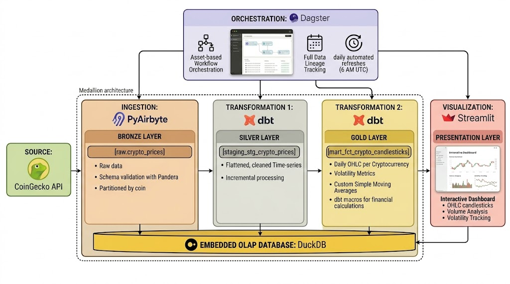

# Crypto ELT Pipeline

> **Modern ELT pipeline** analyzing cryptocurrency market trends through OHLC candlestick charts and volatility metrics. Features incremental extraction (~97% fewer API calls), Medallion architecture, and full data lineage. Built with Dagster, PyAirbyte, dbt, DuckDB, Polars, and Streamlit.

[](https://www.python.org/downloads/)
[](https://github.com/mohamed-boughattas/crypto-elt-pipeline/actions/workflows/ci.yml)
[](https://docs.pytest.org/)
[](https://pandera.readthedocs.io/)
[](https://pola.rs/)
[](https://pyairbyte.readthedocs.io/)
[](https://docs.astral.sh/uv/)
[](https://docs.astral.sh/ruff/)
[](https://www.docker.com/)
[](https://app.codecov.io/gh/mohamed-boughattas/crypto-elt-pipeline)
[](https://dagster.io/)
[](https://www.getdbt.com/)
[](https://duckdb.org/)
[](https://streamlit.io/)
[](https://sqlfluff.com/)
[](https://mypy-lang.org/)

---

## 🎯 What It Does

Automated pipeline that:

- 📥 **Extracts** cryptocurrency market data from CoinGecko API using PyAirbyte (incremental loading)
- 🔄 **Transforms** raw data into analytics-ready OHLC candlesticks (dbt + Medallion Architecture)
- 📊 **Visualizes** trends via interactive Streamlit dashboard
- 🚀 **Orchestrates** everything through Dagster with full data lineage
- ⏰ **Schedules** daily automated refreshes at 6 AM UTC

**Supported Cryptocurrencies:** Bitcoin, Ethereum, XRP, Solana, Cardano, Avalanche, Polkadot, BNB, Chainlink, Dogecoin (10 coins)

**Key Innovations:**

- **Incremental extraction** reduces API calls by ~97% on daily runs
- **Incremental Silver layer** for efficient data processing

---

## 🏗️ Architecture Overview

[](docs/diagrams/diagram_architetcure.jpg)

**Data Flow:**

1. **Bronze**: Raw nested CoinGecko data (immutable landing zone) - Pandera validated
2. **Silver**: Flattened & cleaned (`stg_crypto_prices`) - incremental, dbt tested
3. **Gold**: Business metrics (`fct_crypto_candlesticks`) - table with SMAs

> **📚 Deep dive:** [System Design Documentation](docs/system-design.md)

---

## ⚡ Quick Start

### Prerequisites

- Python 3.12
- [uv](https://docs.astral.sh/uv/) installed
- Docker (required for PyAirbyte connectors)
- (Optional) CoinGecko Pro API key for higher rate limits

### Run the Pipeline

```bash
# Clone the repository
git clone https://github.com/mohamed-boughattas/crypto-elt-pipeline.git
cd crypto-elt-pipeline

# One command to rule them all
make start
```

**That's it!** 🎉

- **Dagster UI**: <http://localhost:3000>
- **Streamlit Dashboard**: <http://localhost:8501>

> **Need detailed setup?** See [Setup Guide](docs/setup-guide.md)

---

## ⏱️ Expected Runtime

| Operation                            | Time (Free API) | Time (Pro API) | Notes                                                      |
| ------------------------------------ | --------------- | -------------- | ---------------------------------------------------------- |
| **Initial load** (10 coins, 30 days) | ~3-5 min        | ~1-2 min       | First run fetches full history (parallelized)              |
| **Daily refresh** (incremental)      | ~30-60 sec      | ~10-20 sec     | Only fetches new data (~97% fewer API calls, parallelized) |
| **Single coin**                      | ~1-2 min        | ~15-30 sec     | Useful for testing or quick updates                        |
| **dbt transformations**              | ~30-60 sec      | ~30-60 sec     | Same for both tiers (local processing)                     |
| **Dashboard load**                   | ~5-10 sec       | ~5-10 sec      | Queries DuckDB directly                                    |

**Performance Improvements:**

- **Parallel execution**: Bronze layer runs 4 coins simultaneously (3-5x faster)
- **Incremental loading**: Only fetches new data since last run (~97% fewer API calls)
- **Hourly resampling**: Normalizes API granularity differences automatically

**Factors affecting runtime:**

- CoinGecko rate limits: Free tier ~10-50 calls/min, Pro tier ~500+ calls/min
- Docker container startup time (PyAirbyte connector)
- Network latency to CoinGecko API
- System resources (CPU/RAM)

---

## 🛠️ Tech Stack

| Layer               | Technology      | Purpose                            |
| ------------------- | --------------- | ---------------------------------- |
| **Orchestration**   | Dagster         | Asset-based workflow orchestration |
| **Extraction**      | PyAirbyte       | Serverless data ingestion          |
| **Transformation**  | dbt             | SQL-based modeling (Medallion)     |
| **Storage**         | DuckDB + Polars | Embedded OLAP database             |
| **Visualization**   | Streamlit       | Interactive dashboards             |
| **Package Manager** | uv              | Ultra-fast dependency resolution   |

---

## 📁 Project Structure

```text
crypto-elt-pipeline/
├── src/crypto_elt_pipeline/      # Core Orchestration Logic
│   ├── definitions.py            # Dagster entry point
│   ├── config.py                 # Centralized configuration (coins.yaml loader)
│   ├── constants.py              # Global paths
│   ├── utils/
│   │   ├── crypto_api.py        # CoinGecko API client with retry logic
│   │   ├── crypto_db.py         # Database utilities for DuckDB operations
│   │   └── crypto_transform.py  # Data transformation utilities
│   └── defs/
│       ├── assets/
│       │   ├── ingestion.py      # PyAirbyte extraction (Bronze)
│       │   ├── dbt.py            # Dagster-dbt integration
│       │   └── external.py       # External asset definitions
│       ├── schedules.py          # Schedules & sensors
│       └── resources.py          # DuckDB-Polars I/O Manager
│
├── config/
│   └── coins.yaml                # Single source of truth for coins
│
├── dbt_project/                  # Transformation Layer (Medallion)
│   ├── models/
│   │   ├── staging/              # Silver Layer
│   │   │   ├── stg_crypto_prices.sql
│   │   │   └── staging.yml       # Data quality tests & documentation
│   │   └── marts/                # Gold Layer
│   │       ├── fct_crypto_candlesticks.sql
│   │       └── marts.yml         # OHLC validation & business logic
│   ├── macros/
│   │   └── financial_calculations.sql  # Reusable financial macros
│   ├── tests/                    # dbt test files
│   ├── seeds/                    # dbt seed files
│   ├── logs/                     # dbt execution logs
│   ├── target/                   # dbt compiled artifacts
│   └── dbt_project.yml
│
├── streamlit_dashboard/          # Presentation Layer
│   └── dashboard.py              # Interactive crypto analytics
│
├── tests/                        # Test Suite (112 tests)
│   ├── conftest.py               # Shared fixtures
│   ├── test_constants.py         # Path tests (14 tests)
│   ├── test_schemas.py           # Schema validation tests (12 tests)
│   ├── test_ingestion.py         # Ingestion tests (36 tests)
│   ├── test_data_quality.py      # Data quality tests (15 tests)
│   ├── test_crypto_api.py        # API client tests (8 tests)
│   ├── test_crypto_db.py         # Database utility tests (9 tests)
│   └── test_integration.py       # End-to-end tests (17 tests)
│
├── docs/                         # Documentation
├── data/                         # DuckDB database (gitignored)
├── Makefile                      # Project automation
└── pyproject.toml                # Dependencies
```

---

## 📋 Common Commands

```bash
make start          # Full pipeline + dashboard (automated)
make pipeline       # Run data pipeline (all coins)
make dev            # Launch Dagster development server
make dashboard      # Launch Streamlit dashboard
make test           # Run all tests
make lint           # Run linting and format checks
make clean          # Clean generated files (preserves history)
```

### Advanced Commands

```bash
make coin=bitcoin pipeline-coin  # Run pipeline for specific coin
make deep-clean                  # Full clean including run history
```

### Development Setup

```bash
# Install pre-commit hooks for code quality
uv run pre-commit install

# Run pre-commit on all files
uv run pre-commit run --all-files
```

> **All commands:** run `make help`

---

## 📊 Key Features

### 🚀 Performance

- **Incremental extraction**: Only fetches new data since last run (~97% fewer API calls)
- **Incremental Silver layer**: Only processes new data (100x faster daily refreshes)
- **Polars I/O Manager**: 5-10x faster than Pandas for DataFrame operations
- **Smart refresh**: Always re-processes current day for intra-day accuracy
- **Hourly resampling**: Normalizes API granularity differences automatically

### 🏗️ Architecture

- **Medallion layers**: Bronze → Silver → Gold data quality progression
- **Software-Defined Assets**: Full data lineage tracking in Dagster
- **Idempotent pipeline**: Safe to re-run anytime without duplicates
- **Centralized configuration**: Single source of truth via `config/coins.yaml`

### 📈 Analytics

- OHLC candlestick charts with Plotly
- Daily volatility calculations
- Volume-weighted analysis
- Real-time price tracking
- Historical trend visualization
- 7-day and 25-day simple moving averages
- Daily price change percentage

### 🎨 Enhanced dbt Transformations

- **Comprehensive testing framework**: Unit tests for data quality validation
- **Professional documentation**: Detailed column descriptions with business context
- **Reusable macros**: Standardized financial calculations for consistency
  - `calculate_volatility()` - Intraday volatility percentage
  - `calculate_simple_moving_average()` - Configurable window SMAs
  - `calculate_price_change()` - Daily price change percentage
  - `calculate_price_range()` - Absolute price range
- **Performance optimization**: Strategic clustering and indexing for time-series queries
- **Data quality tracking**: Sample count and completeness metrics
- **Bollinger Bands**: Technical analysis indicators for volatility and trend analysis
- **Incremental processing**: Efficient daily updates with watermark-based loading

> **Feature details:** [Data Modeling](docs/data-modeling.md)

---

## 📚 Documentation

| Document                                  | Description                                  |
| ----------------------------------------- | -------------------------------------------- |
| [📐 System Design](docs/system-design.md) | Detailed system design & component breakdown |
| [🗂️ Data Modeling](docs/data-modeling.md) | Medallion architecture & dbt transformations |
| [🚀 Setup Guide](docs/setup-guide.md)     | Detailed installation & configuration        |
| [🧪 Testing Guide](docs/testing.md)       | Testing strategy & writing tests             |

---

## 🎯 Use Cases

This pipeline demonstrates modern data engineering patterns:

- ✅ **ELT over ETL**: Load first, transform in the warehouse
- ✅ **Asset-based orchestration**: Focus on "what to build" not "what to do"
- ✅ **Incremental extraction & transformations**: Process only new data
- ✅ **Embedded analytics**: No infrastructure overhead
- ✅ **Code-first approach**: Everything in version control

**Perfect for:** Data engineering portfolios, learning modern data stack, crypto market analysis

---

## 🔄 Data Flow

```text
1. Extract   → PyAirbyte fetches crypto data from CoinGecko API (incremental)
2. Load      → Raw data lands in raw.crypto_prices (Bronze) via Polars
3. Transform → dbt processes through staging (Silver) to mart (Gold)
4. Visualize → Streamlit queries Gold layer for interactive analytics
```

**Incremental Loading:**

- First run: Fetches 30 days of historical data
- Subsequent runs: Only fetches data since last timestamp (~97% fewer API calls)
- Hourly resampling: Normalizes 5-minute granularity to hourly for consistency

**Database Structure:**

```text
crypto.duckdb
├── raw schema (Bronze)
│   └── crypto_prices          # Nested raw data, partitioned by coin
├── staging schema (Silver)
│   └── stg_crypto_prices      # Flattened, cleaned time-series
└── mart schema (Gold)
    └── fct_crypto_candlesticks # Daily OHLC per cryptocurrency
```

---

## 📊 Dashboard Features

The Streamlit dashboard provides:

- 💰 **Real-time metrics**: Current price, 24h change, market cap
- 📈 **Interactive charts**: OHLC candlesticks with zoom & pan
- 📊 **Volume analysis**: Trading volume trends over time
- 📉 **Volatility tracking**: Daily volatility percentage
- 🎯 **Key statistics**: Historical highs/lows, averages
- 📅 **Date filtering**: Analyze specific time periods

---

## ✅ Data Quality

Multiple validation layers ensure data reliability:

1. **Pandera schemas** in PyAirbyte ingestion (Bronze) - validates nested API response structure
2. **Enhanced business logic validation** - prices, market cap, and volume must be positive
3. **dbt tests** for not-null & uniqueness (Silver) - **112 pytest tests** + dbt tests
4. **Type safety** with explicit casting (Silver)
5. **Business logic validation** in Gold layer - OHLC consistency checks
6. **Sample count tracking** to detect data gaps

---

## 🤝 Contributing

This is a personal learning project, but suggestions are welcome!

### How to Contribute

1. Fork the repository
2. Create a feature branch: `git checkout -b feature/my-improvement`
3. Make changes and ensure tests pass: `make test`
4. Run linting: `make lint`
5. Submit a pull request

### Code Style

- Python: Ruff formatting (auto-fixed via pre-commit)
- SQL: SQLFluff with dbt templating
- Commit messages: Descriptive and concise

---

## 🙏 Acknowledgments

- [CoinGecko](https://www.coingecko.com/) for free cryptocurrency API
- [Dagster](https://dagster.io/) for modern orchestration
- [PyAirbyte](https://docs.airbyte.com/using-airbyte/pyairbyte/) for code-first data extraction
- [dbt Labs](https://www.getdbt.com/) for transformation framework
- [DuckDB](https://duckdb.org/) for embedded analytics
- [Polars](https://pola.rs/) for high-performance DataFrames
- [Streamlit](https://streamlit.io/) for interactive dashboards
- [Pandera](https://pandera.readthedocs.io/) for data validation
- [uv](https://docs.astral.sh/uv/) for ultra-fast package management
