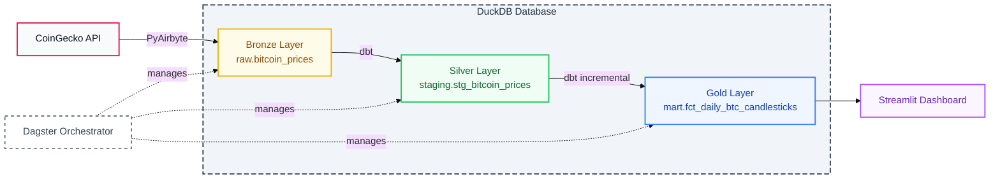

# Bitcoin Analysis Pipeline

An end-to-end ELT pipeline for analyzing Bitcoin market trends through OHLC candlestick charts and volatility metrics. Built with modern data engineering best practices using **Dagster** for orchestration, **PyAirbyte** for extraction, **dbt** for transformations, **DuckDB** for storage, and **Streamlit** for visualization.

---

## 🎯 Architecture Overview

### 1. Ingestion: PyAirbyte & CoinGecko API

Unlike traditional setups requiring a heavy Airbyte server, this project utilizes **PyAirbyte** for high-performance, code-centric ingestion.

- **Source:** [CoinGecko Coins API Connector](https://docs.airbyte.com/integrations/sources/coingecko-coins)
- **Strategy:** Uses PyAirbyte to run data extraction directly in Python, combining Airbyte's proven connector ecosystem with a lightweight, serverless architecture.
- **Asset Mapping:** The CoinGecko stream is mapped directly to a Dagster Software-Defined Asset, ensuring that raw ingestion is the first link in our data lineage.

### 2. Orchestration: Dagster (Software-Defined Assets)

This project utilizes Dagster's **Software-Defined Assets (SDA)** to shift the focus from "what to do" to "what to build."

- **Why?** It provides built-in lineage, data-aware scheduling, and asset materialization.
- **Modern CLI:** Leverages the new `dg` CLI for streamlined project management and deployment.

### 3. Transformation: dbt & Medallion Architecture

Data modeling follows the **Medallion Architecture** to ensure data quality and performance:

- **Bronze (Raw):** PyAirbyte-ingested CoinGecko data landed in DuckDB as-is.
- **Silver (Staging):** Type casting, timestamp normalization (ISO to UTC), and price standardization.
- **Gold (Marts):** Business-ready models with **incremental materialization** (e.g., `fct_daily_btc_candlesticks`) optimized for low-latency dashboarding.

**Key Performance Feature: Incremental Models**

- **Strategy:** Only processes new/updated days instead of full table refreshes.
- **Smart Refresh:** Always re-processes the current day to capture intra-day updates.
- **Performance Gain:** 100x faster for daily refreshes vs. full rebuilds.
- **Scalability:** Handles years of historical data efficiently.

### 4. Storage: DuckDB with Polars I/O Manager

- **DuckDB:** Provides columnar storage and vectorized execution for OLAP queries without the infrastructure overhead of a server-based warehouse.
- **Polars Integration:** Uses Dagster's `DuckDBPolarsIOManager` for high-performance data transfers between assets.
  - **Why Polars?** 5-10x faster than Pandas for DataFrame operations
  - **Zero-copy reads:** Efficient data movement between DuckDB and Python
  - **Lazy evaluation:** Query optimization before execution
  - **Memory efficiency:** Handles larger-than-RAM datasets
- **Integration:** Seamlessly bridges the gap between dbt (transformation) and Streamlit (visualization) via a local `.duckdb` file.
- **Advantages:** Zero configuration, embedded database, perfect for local development and small-to-medium datasets.

### 5. Tooling: uv & Makefile

- **uv:** Ultra-fast Python package manager that ensures reproducible environments through lock file-based dependency resolution.
- **Makefile:** Centralizes project commands into simple, memorable targets for consistent developer experience.

---

## 🧩 Architecture Diagram



---

## 📊 Data Modeling

### Medallion Architecture Layers

#### Bronze Layer (Raw)

- **Table:** `raw.bitcoin_prices`
- **Source:** PyAirbyte connector to CoinGecko API
- **Schema:** `coin, currency, timestamp, price, market_cap, volume`
- **Purpose:** Immutable landing zone

#### Silver Layer (Staging)

**Table:** `staging.stg_bitcoin_prices`

- Type casting to proper data types
- Timestamp normalization (ISO to UTC)
- Price and volume standardization
- Data quality checks (not-null, uniqueness)

#### Gold Layer (Marts)

**Table:** `mart.fct_daily_btc_candlesticks` (Incremental)

**OHLC Candlestick Logic:**

```sql
-- Open: Price at first timestamp of the day
arg_min(price, timestamp) as open_price

-- High: Maximum price during the day
max(price) as high_price

-- Low: Minimum price during the day
min(price) as low_price

-- Close: Price at last timestamp of the day
arg_max(price, timestamp) as close_price

-- Calculated Metrics
sum(volume) as daily_volume
count(*) as samples_count
round(((max(price) - min(price)) / min(price)) * 100, 2) as volatility_pct
```

**Incremental Strategy:**

```sql

    where date_trunc('day', timestamp)
        >= (select max(date_day) from {{ this }})

```

This ensures only new data is processed, with smart refresh for the current day.

**Key Metrics Calculated:**

- **Daily Volatility:** `(High - Low) / Low * 100`
- **Price Trends:** Moving averages and day-over-day percentage changes
- **Liquidity Insights:** Volume-weighted analysis
- **Data Quality:** Sample count tracking to detect gaps

---

## 🚀 Getting Started

### Prerequisites

- Python 3.10+
- [uv](https://docs.astral.sh/uv/) installed

### 1. Fully Automated Run (Recommended)

```bash
make start
```

### 2. Manual Exploration

If you prefer to inspect the layers individually:

```bash
# Setup Environment
make setup

# Run Pipeline
make pipeline

# Open Dagster UI
make orchestrate

# Launch Dashboard
make dashboard
```

**Access Points:**

- **Dagster UI:** http://localhost:3000
- **Streamlit Dashboard:** http://localhost:8501

---

## 🛠️ Project Structure

```
crypto-elt-pipeline/
│
├── src/crypto_elt_pipeline/       # Main Python package
│   ├── definitions.py              # Dagster definitions entry point
│   ├── constants.py                # Configuration & settings
│   └── defs/
│       ├── assets/
│       │   ├── ingestion.py        # PyAirbyte data extraction
│       │   └── dbt.py              # dbt transformation orchestration
│       └── resources.py            # DuckDB-Polars I/O Manager & dbt resource
│
├── dbt_project/                    # dbt transformation layer
│   ├── models/
│   │   ├── staging/                # Silver layer: cleaned data
│   │   │   ├── stg_bitcoin_prices.sql
│   │   │   └── sources.yml
│   │   └── marts/                  # Gold layer: business metrics
│   │       ├── fct_daily_btc_candlesticks.sql
│   │       └── marts.yml
│   ├── macros/
│   │   └── generate_schema_name.sql
│   ├── dbt_project.yml             # dbt configuration
│   └── profiles.yml                # Database connections
│
├── streamlit_dashboard/            # Visualization layer
│   └── dashboard.py                # Interactive Streamlit app
│
├── data/                           # Local database (gitignored)
│   └── crypto.duckdb               # DuckDB analytical database
│
├── Makefile                        # Project automation commands
├── pyproject.toml                  # Python dependencies (uv)
├── uv.lock                         # Locked dependency versions
└── README.md                       # This file
```

**Key Directories:**

- **`src/crypto_elt_pipeline/`**: Core orchestration logic using Dagster
- **`defs/resources.py`**: Configures DuckDB-Polars I/O Manager and dbt resource
- **`dbt_project/models/`**: SQL-based data transformations (Medallion architecture)
- **`streamlit_dashboard/`**: User-facing visualization layer
- **`data/`**: Local DuckDB warehouse

---

## 📋 Available Commands

All commands are available through the Makefile:

| Command            | Description                                       |
| ------------------ | ------------------------------------------------- |
| `make start`       | Full automated run (Setup + Pipeline + Dashboard) |
| `make dashboard`   | Launch Streamlit Dashboard                        |
| `make clean`       | Clean temporary files                             |
| `make orchestrate` | Open Dagster UI (localhost:3000)                  |
| `make pipeline`    | Run data pipeline only (CLI)                      |
| `make status`      | Check system health                               |
| `make clean-all`   | Full cleanup (temporary files + database)         |

---

## 🔄 Data Flow

1. **Extract**: PyAirbyte fetches Bitcoin data from CoinGecko API
2. **Load**: Raw data lands in `raw.bitcoin_prices` (Bronze layer) via Polars I/O Manager
3. **Transform**: dbt processes data through `staging.stg_bitcoin_prices` (Silver) to `mart.fct_daily_btc_candlesticks` (Gold)
4. **Visualize**: Streamlit dashboard queries the Gold layer for interactive analytics

**Data Transfer Layer:**

- **DuckDB-Polars I/O Manager** handles efficient data movement between Dagster assets
- Enables high-performance DataFrame operations during asset materialization

**Database Structure:**

```
crypto.duckdb
├── raw schema (Bronze)
│   └── bitcoin_prices
├── staging schema (Silver)
│   └── stg_bitcoin_prices
└── mart schema (Gold)
    └── fct_daily_btc_candlesticks
```

---

## 📊 Dashboard Features

The Streamlit dashboard provides:

- **Real-time price tracking**: Current Bitcoin price and market cap
- **Historical trends**: Interactive price charts with date range selection
- **Volume analysis**: Trading volume visualization over time
- **Volatility metrics**: Daily volatility calculations and trends
- **OHLC candlesticks**: Professional financial charting
- **Key statistics**: 24h change, market dominance, and more

---

## ✅ Data Quality

The pipeline includes multiple layers of data validation:

1. **PyAirbyte**: Schema validation during ingestion
2. **dbt tests**: Not-null and uniqueness constraints on staging models
3. **Type safety**: Explicit type casting in staging layer
4. **Business logic validation**: Range checks and outlier detection in Gold layer
5. **Sample count tracking**: Detects data gaps or missing observations

---

## 💡 Implementation Notes

- **Polars I/O Manager:** Uses DuckDBPolarsIOManager for high-performance data transfers between assets, providing 5-10x speedup over Pandas-based alternatives.
- **Idempotency:** The PyAirbyte ingestion is configured to be idempotent; running it multiple times refreshes the DuckDB assets without duplication.
- **Concurrency:** Dagster manages the dependency graph to ensure dbt transformations only begin once the PyAirbyte ingestion is validated.
- **Testing:** dbt models include built-in data quality tests (not-null, unique constraints) that run automatically during transformation.
- **Incremental Strategy:** The Gold layer uses incremental materialization to process only new data, dramatically improving performance.
- **Smart Refresh:** Current day data is always re-processed to capture intra-day price movements.

---

## 📚 Additional Resources

- [Dagster Documentation](https://docs.dagster.io/)
- [dbt Documentation](https://docs.getdbt.com/)
- [PyAirbyte Documentation](https://docs.airbyte.com/using-airbyte/pyairbyte/getting-started)
- [DuckDB Documentation](https://duckdb.org/docs/)
- [Polars Documentation](https://pola.rs/)
- [Streamlit Documentation](https://docs.streamlit.io/)
- [Medallion Architecture](https://www.databricks.com/glossary/medallion-architecture)
