# Bitcoin Analysis Pipeline

> **Modern ELT pipeline** analyzing Bitcoin market trends through OHLC candlestick charts and volatility metrics. Built with Dagster, PyAirbyte, dbt, DuckDB, and Streamlit.

[](https://www.python.org/downloads/)
[](https://dagster.io/)
[](https://www.getdbt.com/)
[](https://duckdb.org/)
[](https://streamlit.io/)

---

## 🎯 What It Does

Automated pipeline that:

- 📥 **Extracts** Bitcoin market data from CoinGecko API using PyAirbyte
- 🔄 **Transforms** raw data into analytics-ready OHLC candlesticks (dbt + Medallion Architecture)
- 📊 **Visualizes** trends via interactive Streamlit dashboard
- 🚀 **Orchestrates** everything through Dagster with full data lineage

**Key Innovation:** Uses **incremental materialization** in dbt Gold layer for 100x faster refreshes vs. full rebuilds.

---

## 🏗️ Architecture Overview



**Data Flow:**

1. **Bronze**: Raw CoinGecko data (immutable landing zone)
2. **Silver**: Cleaned & typed (`stg_bitcoin_prices`)
3. **Gold**: Business metrics (`fct_daily_btc_candlesticks` - incremental)

> **📚 Deep dive:** [System Design Documentation](docs/system-design.md)

---

## ⚡ Quick Start

### Prerequisites

- Python 3.10+
- [uv](https://docs.astral.sh/uv/) installed

### Run the Pipeline

```bash
# Clone the repository
git clone https://github.com/mohamed-boughattas/crypto-elt-pipeline.git
cd crypto-elt-pipeline

# One command to rule them all
make start
```

**That's it!** 🎉

- **Dagster UI**: <http://localhost:3000>
- **Streamlit Dashboard**: <http://localhost:8501>

> **Need detailed setup?** See [Setup Guide](docs/setup-guide.md)

---

## 🛠️ Tech Stack

| Layer | Technology | Purpose |
| ------- | ----------- | --------- |
| **Orchestration** | Dagster | Asset-based workflow orchestration |
| **Extraction** | PyAirbyte | Serverless data ingestion |
| **Transformation** | dbt | SQL-based modeling (Medallion) |
| **Storage** | DuckDB + Polars | Embedded OLAP database |
| **Visualization** | Streamlit | Interactive dashboards |
| **Package Manager** | uv | Ultra-fast dependency resolution |

---

## 📁 Project Structure

```text
crypto-elt-pipeline/
├── src/crypto_elt_pipeline/      # Dagster orchestration
│   ├── defs/
│   │   ├── assets/
│   │   │   ├── ingestion.py      # PyAirbyte extraction
│   │   │   ├── dbt.py            # dbt integration
│   │   │   └── external.py       # External assets
│   │   └── resources.py          # DuckDB-Polars I/O Manager
│   ├── definitions.py            # Dagster entry point
│   └── constants.py              # Configuration
│
├── dbt_project/                  # dbt transformations
│   └── models/
│       ├── staging/              # Silver layer
│       └── marts/                # Gold layer (incremental)
│
├── streamlit_dashboard/          # Visualization
│   └── dashboard.py
│
├── data/                         # DuckDB database (gitignored)
├── Makefile                      # Project automation
└── docs/                         # Detailed documentation
```

---

## 📋 Common Commands

```bash
make start          # Full pipeline + dashboard (automated)
make orchestrate    # Open Dagster UI
make pipeline       # Run data pipeline only
make dashboard      # Launch Streamlit dashboard
make status         # System health check
make clean          # Clean temporary files
make clean-all      # Full cleanup (temp + database)
```

> **All commands:** run `make help`

---

## 📊 Key Features

### 🚀 Performance

- **Incremental dbt models**: Only processes new data (100x faster daily refreshes)
- **Polars I/O Manager**: 5-10x faster than Pandas for DataFrame operations
- **Smart refresh**: Always re-processes current day for intra-day accuracy

### 🏗️ Architecture

- **Medallion layers**: Bronze → Silver → Gold data quality progression
- **Software-Defined Assets**: Full data lineage tracking in Dagster
- **Idempotent pipeline**: Safe to re-run anytime without duplicates

### 📈 Analytics

- OHLC candlestick charts with Plotly
- Daily volatility calculations
- Volume-weighted analysis
- Real-time price tracking
- Historical trend visualization

> **Feature details:** [Data Modeling](docs/data-modeling.md)

---

## 📚 Documentation

| Document | Description |
| ---------- | ------------- |
| [📐 System Design](docs/system-design.md) | Detailed system design & component breakdown |
| [🗂️ Data Modeling](docs/data-modeling.md) | Medallion architecture & dbt transformations |
| [🚀 Setup Guide](docs/setup-guide.md) | Detailed installation & configuration |

---

## 🎯 Use Cases

This pipeline demonstrates modern data engineering patterns:

- ✅ **ELT over ETL**: Load first, transform in the warehouse
- ✅ **Asset-based orchestration**: Focus on "what to build" not "what to do"
- ✅ **Incremental transformations**: Process only new data
- ✅ **Embedded analytics**: No infrastructure overhead
- ✅ **Code-first approach**: Everything in version control

**Perfect for:** Data engineering portfolios, learning modern data stack, crypto market analysis

---

## 🔄 Data Flow

```text
1. Extract   → PyAirbyte fetches Bitcoin data from CoinGecko API
2. Load      → Raw data lands in raw.bitcoin_prices (Bronze) via Polars
3. Transform → dbt processes through staging (Silver) to marts (Gold)
4. Visualize → Streamlit queries Gold layer for interactive analytics
```

**Database Structure:**

```text
crypto.duckdb
├── raw schema (Bronze)
│   └── bitcoin_prices
├── staging schema (Silver)
│   └── stg_bitcoin_prices
└── mart schema (Gold)
    └── fct_daily_btc_candlesticks
```

---

## 📊 Dashboard Features

The Streamlit dashboard provides:

- 💰 **Real-time metrics**: Current price, 24h change, market cap
- 📈 **Interactive charts**: OHLC candlesticks with zoom & pan
- 📊 **Volume analysis**: Trading volume trends over time
- 📉 **Volatility tracking**: Daily volatility percentage
- 🎯 **Key statistics**: Historical highs/lows, averages
- 📅 **Date filtering**: Analyze specific time periods

---

## ✅ Data Quality

Multiple validation layers ensure data reliability:

1. **Pandera schemas** in PyAirbyte ingestion (Bronze)
2. **dbt tests** for not-null & uniqueness (Silver)
3. **Type safety** with explicit casting (Silver)
4. **Business logic validation** in Gold layer
5. **Sample count tracking** to detect data gaps

> **Quality framework:** [Data Quality Guide](docs/data-modeling.md#data-quality)

---

## 🙏 Acknowledgments

- [CoinGecko](https://www.coingecko.com/) for free cryptocurrency API
- [Dagster](https://dagster.io/) for modern orchestration
- [dbt Labs](https://www.getdbt.com/) for transformation framework
- [DuckDB](https://duckdb.org/) for embedded analytics
- [Polars](https://pola.rs/) for high-performance DataFrames
